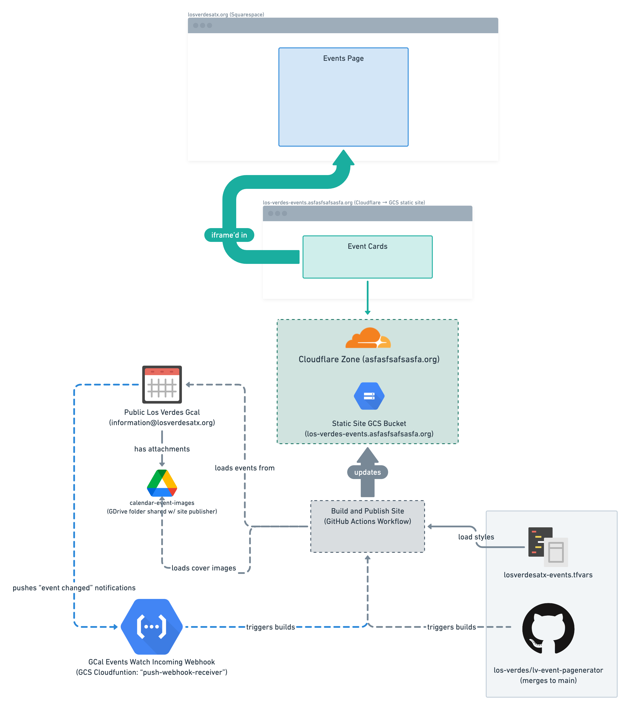

# lv-event-pagenerator

[](https://github.com/los-verdes/lv-event-pagenerator/actions/workflows/deploy_infrastrcture.yml)
[](https://github.com/los-verdes/lv-event-pagenerator/actions/workflows/build_and_publish_site.yml)

Production of GCS-housed static site listing events retrieved from a given public Google calendar.

Example deployments of this site can be seen under the [prod-site environment's deployment history](https://github.com/los-verdes/lv-event-pagenerator/deployments/activity_log?environment=prod-site) and specifically at: [events.losverd.es](https://events.losverd.es/).

## Usage

1. Add the application service accounts to the source public calendar with "Manage events" access. (Manage events access required for viewing event colors which are used to map to event "categories".)
1. Update calendar event colors to match the desired categories. E.g.,
    - `los-verdes` category -> `Sage`
    - `la-murga` category -> `Graphite`
    - `home-games` category -> `Grape`
    - `away-games` category -> `Flamingo`

### Styling

Event card covers have shims available for setting the overall background color as well as the text foreground/background color. To modify styles, edit the `event_categories` map within [losverdesatx-events.tfvars](losverdesatx-events.tfvars).

#### Cover Images

All cover images must be shared with the application's service account; either by being placed in a GDrive folder shared with those accounts or shared directly. There are two options for setting these images.

- Event card cover images can be set on a category-scope via the `default_cover_image` key contained in the `event_categories` map within [losverdesatx-events.tfvars](losverdesatx-events.tfvars). Category image URL's should be the value shown when opening the "Get Link" dialog for a file within Google Drive.
- Alternatively, attaching any Google Drive-housed image to a Google calendar event will see that image used as the event card cover. The attachment can have any filename and the application will use the first image attachment it discovers (regardless of how many images are attached(!)).

### Page Embedding

  ```html
  <!-- This bit should be placed within an "embed" block over on ye 'ole Squarespace -->
  <div>
    <iframe id="lv-events-embed" width="100%" src="https://events.losverd.es/" scrolling="no"></iframe>
  </div>
  ```

## Application Architecture

### System Diagram



### Deployment

Outside of this repository, all infrastructure resources are housed in an associated GCP project. Management of this project is handled by Terraform and the [Deploy Infrastructure](https://github.com/los-verdes/lv-event-pagenerator/actions/workflows/deploy_infrastrcture.yml) GitHub actions workflow. DNS / CDN needs are handled by a Cloudflare free plan. Site builds are performed following the successful conclusion of a [Deploy Infrastructure](https://github.com/los-verdes/lv-event-pagenerator/actions/workflows/deploy_infrastrcture.yml) workflow run and/or changes made to the source Google calendar.

### Service Accounts

For the production Los Verdes events page app, there are two GCP service accounts involved:

- `site-publisher@losverdesatx-events.iam.gserviceaccount.com`:

  This is the account used for production (i.e., `main` branch) runs. Available in the `site_publisher_sa_email` Terraform output.
- `test-site-publisher@losverdesatx-events.iam.gserviceaccount.com`

  This is the account used for test (i.e., pull request) runs. Available he `test_site_publisher_sa_email` Terraform output.

## Development

## Local Runs

Site builds expected to be performed within a GitHub Actions workflow for access to the requisite credentials, etc. To apply this repository's Terraform configuration or run a site build you'll first need:

- Access to the associated GCP project (for retriving settings and publishing content). This is done by inserting whatever username is associated with your [gcloud application-default credentials](https://cloud.google.com/sdk/gcloud/reference/auth/application-default/login) in the `gcp_project_editors` (or `gcp_project_owners`) lists defined in [losverdesatx-events.tfvars](losverdesatx-events.tfvars)
- Afterwards, be sure to set up `gcloud` and configure it for this project:

    ```shellsession
    $ gcloud auth application-default login
    $ gcloud config set project 'losverdesatx-events'
    Updated property [core/project].
    export EVENTS_PAGE_SA_EMAIL="$(terraform -chdir=terraform output -raw site_publisher_sa_email)"
    ./events_page/app.py
    ```

- [Optional] Install [just](https://github.com/casey/just)

### Applying Terraform

1. Export a couple of sensitive variables. Access to these secrets is not currently self-serve, so reach out to @jeffwecan to request values if needed (Actions workflow runs retrieve these credentials via repository secrets):

    ```shellsession
    export TF_VAR_cloudflare_api_token="..."
    export TF_VAR_site_publisher_gh_app_key="..."
    ```

2. Run your Terraform operation using just and the `run-tf` recipe. E.g.:

    ```shellsession
    $ just run-tf apply
    terraform -chdir="/Users/jeffwecan/workspace/lv-event-pagenerator/./terraform" apply -var-file=../losverdesatx-events.tfvars
    random_password.webhook_token: Refreshing state... [id=none]

    ###

    Do you want to perform these actions?
      Terraform will perform the actions described above.
      Only 'yes' will be accepted to approve.

      Enter a value: ...
    ```

### Viewing Site Locally

- To ensure consistency with automated runs, instruct the application to impersonate our GCP service account with the `EVENTS_PAGE_SA_EMAIL` env var:

    ```shellsession
    export EVENTS_PAGE_SA_EMAIL="$(terraform -chdir=terraform output -raw site_publisher_sa_email)"
    ```

- [Optional] If you want to use the local settings within [losverdesatx-events.tfvars](losverdesatx-events.tfvars), set the `EVENTS_PAGE_LOAD_LOCAL_TF_VARS` var as well:

    ```shellsession
    export EVENTS_PAGE_LOAD_LOCAL_TF_VARS="$PWD/losverdesatx-events.tfvars"
    ```

- Start up a local server with `just serve`. When making changes to event categories or cover images, you'll need to re-run this recipe to have those changes reflected. Otherwise, simply refreshing the page in a browser will pull in any HTML template changes, etc.:

    ```shellsession
    $ just serve
    just run-py './render_templated_styles.py'
    # export EVENTS_PAGE_SA_EMAIL="$(terraform -chdir=terraform output -raw site_publisher_sa_email)"
    cd "events_page" && ./render_templated_styles.py
    # ...
    * Serving Flask app 'app' (lazy loading)
    * Environment: production
      WARNING: This is a development server. Do not use it in a production deployment.
      Use a production WSGI server instead.
    * Debug mode: on
    * Running on all addresses.
      WARNING: This is a development server. Do not use it in a production deployment.
    * Running on http://192.168.86.31:5000/ (Press CTRL+C to quit)
    * Restarting with stat
    [D 220116 08:29:34 config:104] Config loaded from en...
    ```
